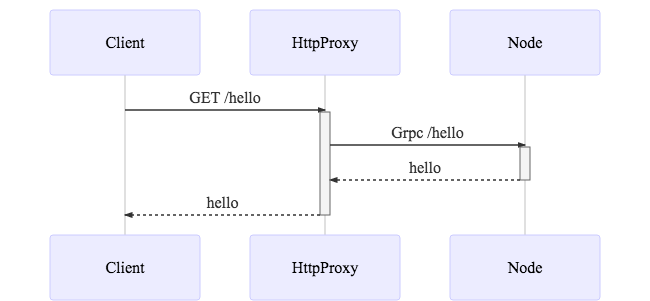

# Goal
Generate rest API for Grpc with node.

# Component
- Node server
- Grpc http proxy server
- Curl client

# API
```
GET /hello
return hello
```
# Sequence flow


# Source from
- https://github.com/grpc-ecosystem/grpc-gateway
- https://github.com/grpc/grpc

# Requirements
- node.js v10.15.0 or later
- go v1.10.4 or later
- ProtocolBuffers v3.0.0 or later (Optional)

# Compile proto
- Optional (It repository already includes compiled file)
```
protoc -I/usr/local/include -I. \
  -I$GOPATH/src \
  -I$GOPATH/src/github.com/grpc-ecosystem/grpc-gateway/third_party/googleapis \
  --grpc-gateway_out=logtostderr=true:./httpproxy \
  --go_out=plugins=grpc:./httpproxy \
  ./protos/helloworld.proto
```
# Install package dependencies
## Install node package
```
cd node
npm install
```

## Install go package
go get -u as usual the following packages:
```
go get -u \
  "github.com/golang/glog" \
  "github.com/golang/protobuf/proto" \
  "github.com/grpc-ecosystem/grpc-gateway/runtime" \
  "github.com/grpc-ecosystem/grpc-gateway/utilities" \
  "golang.org/x/net/context" \
  "google.golang.org/genproto/googleapis/api/annotations" \
  "google.golang.org/grpc" \
  "google.golang.org/grpc/codes" \
  "google.golang.org/grpc/grpclog" \
  "google.golang.org/grpc/status"
```

# Test
### Run http proxy server (port 8080) 
```
go run httpproxy/server.go
```

### Run node js (port: 50051)
```
node node/greeter_server.js
```

### Run clinet
```
curl http://localhost:8080/hello
```

